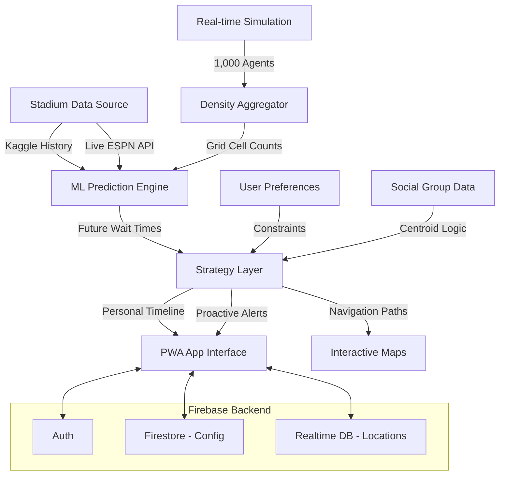

# VenueIQ Architecture Diagram

This document outlines the predictive and reactive layers of the **VenueIQ** Orchestrator.

## System Breakdown

### 1. Perception Layer (simulator.js)
The simulator acts as a digital twin of the stadium. It generates 1,000 unique user traces at 30fps, allowing us to test congestion scenarios (e.g., end of quarter) without a physical crowd.

### 2. ML Prediction Layer (mlPredictionService.js)
Instead of simple averages, we use a 4-factor linear regression model:
- **Density (45%)**: Current load per location.
- **History (35%)**: Historical averages for this specific game segment (e.g., halftime).
- **Momentum (15%)**: Live game flow (stoppages, score changes).
- **Weather (5%)**: Environmental impact on vendor visits.

### 3. Orchestration Layer (timelineService.js)
Uses **Constraint Satisfaction** to find a valid window for all 3-5 group members to meet without missing the "Critical Quarter" highlights.

### 4. Navigation Layer (navigationService.js)
A custom graph-based pathfinder that weights edges based on PREDICTED congestion, not just distance.
